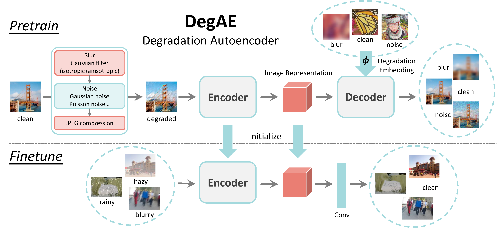
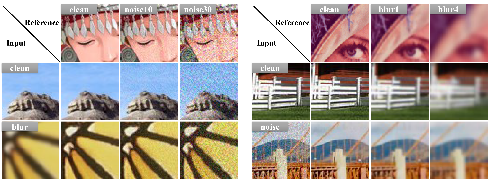

# Degradation Autoencoder [CVPR2023 Highlight]
## DegAE: A New Pretraining Paradigm for Low-level Vision
This paper is accepted by CVPR2023 (highlight).
[[paper]](https://openaccess.thecvf.com/content/CVPR2023/html/Liu_DegAE_A_New_Pretraining_Paradigm_for_Low-Level_Vision_CVPR_2023_paper.html)

Authors: [Yihao Liu](https://scholar.google.com/citations?user=WRIYcNwAAAAJ&hl=en&oi=ao), [Jingwen He](https://scholar.google.com/citations?user=GUxrycUAAAAJ&hl=en&oi=sra), [Jinjin Gu](https://scholar.google.com/citations?user=uMQ-G-QAAAAJ&hl=en&oi=sra), [Xiangtao Kong](https://scholar.google.com/citations?user=lueNzSgAAAAJ&hl=en&oi=sra), [Yu Qiao](https://scholar.google.com/citations?user=gFtI-8QAAAAJ&hl=en), [Chao Dong](https://scholar.google.com/citations?user=OSDCB0UAAAAJ&hl=en)

## News

- [2023/7/31] :zap: We have released the codes! Please refer to the following instructions.

## Method Introduction

For pretraining, the encoder accepts a degraded input image and outputs the image representation. The degraded input image is synthesized online through a series of degradation operations. The decoder accepts a reference degradation embedding, which is obtained by a degradation representor $\phi$. Then, the decoder attempts to transfer the reference degradation to the corrupted input image. During Finetuning, the decoder is replaced by one convolution layer. We finetune the whole network on downstream tasks such as image dehaze, derain and motion deblur.


Example results of DegAE pretraining. For instance, given an input noise image and a reference blur image, DegAE attempts to transfer the blur degradation to the input image.

## Preparation

### Dependencies

- Python >= 3.6
- Tested on PyTorch==1.13.1+cu116 (may work for other versions)
- Tested on Ubuntu 18.04.1 LTS
- NVIDIA GPU + [CUDA](https://developer.nvidia.com/cuda-downloads) (Tested on cuda11.6)

### Pretrained Models

Download the pretrained models and put the downloaded models in the `experiments/` folder.


|  Phase  |  Task   | Backbone | Pretrained model |
| :-----: | :-----: | :-----:  | :----:           |
| Pretrain | Degradation Transfer <br> (Pretext Task) | SwinIR <br>Backbone    | [[Baidu Disk]](https://pan.baidu.com/s/1PNIuya0zk7DgulBW8n_5Sg?pwd=iugr) <br>(token: iugr) |
| Pretrain | Degradation Transfer <br> (Pretext Task) | Restormer <br>Backbone    | [[Baidu Disk]](https://pan.baidu.com/s/1LS-aIP-kg-s2fl4R0z_dfw?pwd=pcpy) <br>(token: pcpy) |
| Downstream <br>Finetune | Dehaze (ITS) <br> Complex Derain (Rain13K) <br> Motion Deblur (GoPro)  | SwinIR <br>Backbone    | [[Baidu Disk]](https://pan.baidu.com/s/1zzqordfmiq7vn4XMvr2-9Q?pwd=bk4a)<br> (token: bk4a) |
| Downstream <br>Finetune | Dehaze (ITS) <br> Complex Derain (Rain13K) <br> Motion Deblur (GoPro)  | Restormer <br>Backbone    | [[Baidu Disk]](https://pan.baidu.com/s/1OmbQLwyQSeADR5863Xo_3w?pwd=7bnf) <br>(token: 7bnf) |

## Quick Inference
### Pretrain Task: Degradation Autoencoder

Note: All the settings can be adjusted and specified in the corresponding yml file.

1. Test the pretext task with SwinIR backbone.
```
cd codes
python test_DegAE_Pretrain.py -opt options/test/test_DegAE_Pretrain_SwinIR.yml
```

2. Test the pretext task with Restormer backbone.
```
cd codes
python test_DegAE_Pretrain.py -opt options/test/test_DegAE_Pretrain_Restormer.yml
```

### Downstream Tasks
#### Dehaze
1. Test the pretrained dehaze model with SwinIR backbone.
```
cd codes
python test_DegAE_Finetune.py -opt options/test/test_DegAE_Finetune_Dehaze_SwinIR.yml
```
2. Test the pretrained dehaze model with Restormer backbone.
```
cd codes
python test_DegAE_Finetune.py -opt options/test/test_DegAE_Finetune_Dehaze_SwinIR.yml
```

#### Complex Derain
1. Test the pretrained dehaze model with SwinIR backbone.
```
cd codes
python test_DegAE_Finetune.py -opt options/test/test_DegAE_Finetune_Derain_SwinIR.yml
```
2. Test the pretrained dehaze model with Restormer backbone.
```
cd codes
python test_DegAE_Finetune.py -opt options/test/test_DegAE_Finetune_Derain_SwinIR.yml
```

#### Motion Deblur
1. Test the pretrained dehaze model with SwinIR backbone.
```
cd codes
python test_DegAE_Finetune.py -opt options/test/test_DegAE_Finetune_Deblur_SwinIR.yml
```
2. Test the pretrained dehaze model with Restormer backbone.
```
cd codes
python test_DegAE_Finetune.py -opt options/test/test_DegAE_Finetune_Deblur_SwinIR.yml
```

## Citation

If you find our work is useful, please kindly cite it.

```BibTex
@InProceedings{Liu_2023_DegAE, 
author = {Liu, Yihao and He, Jingwen and Gu, Jinjin and Kong, Xiangtao and Qiao, Yu and Dong, Chao}, 
title = {DegAE: A New Pretraining Paradigm for Low-Level Vision}, 
booktitle = {Proceedings of the IEEE/CVF Conference on Computer Vision and Pattern Recognition (CVPR)}, 
month = {June}, 
year = {2023}, 
pages = {23292-23303} 
}
```

